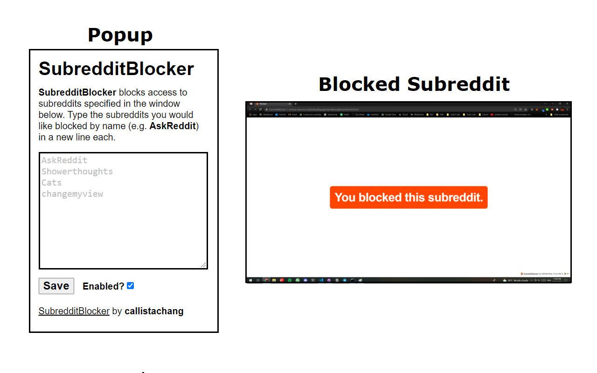

    </img>
    
Subreddit Blocker

    
just scrolled top posts of r/writingprompts for 3 hours straight. this is a cry for help

# Download
Clone this repository, navigate to `chrome://extensions` on Google Chrome, click "Load unpacked", and click on the folder containing the extension.

# Screenshots
